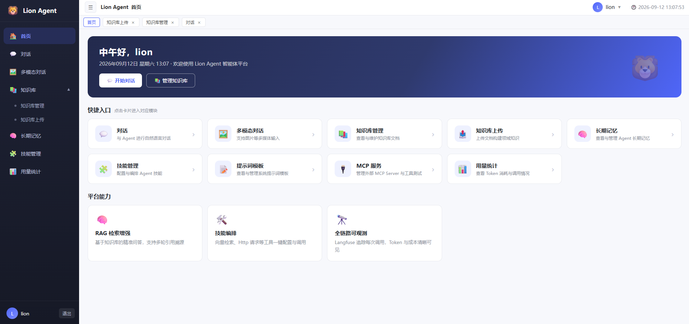
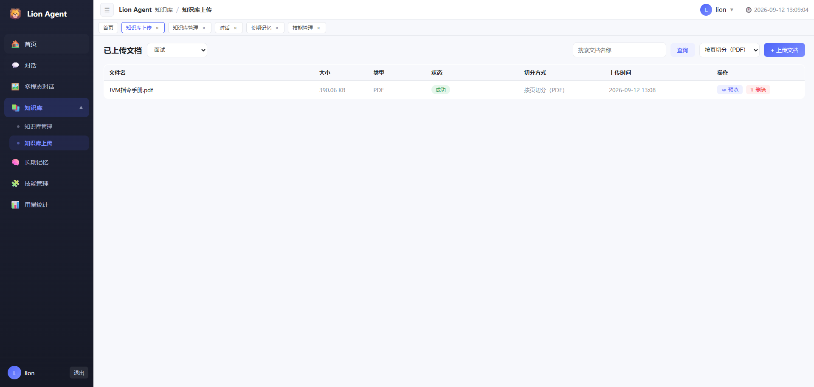
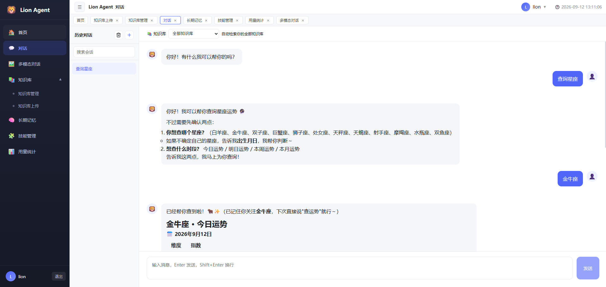
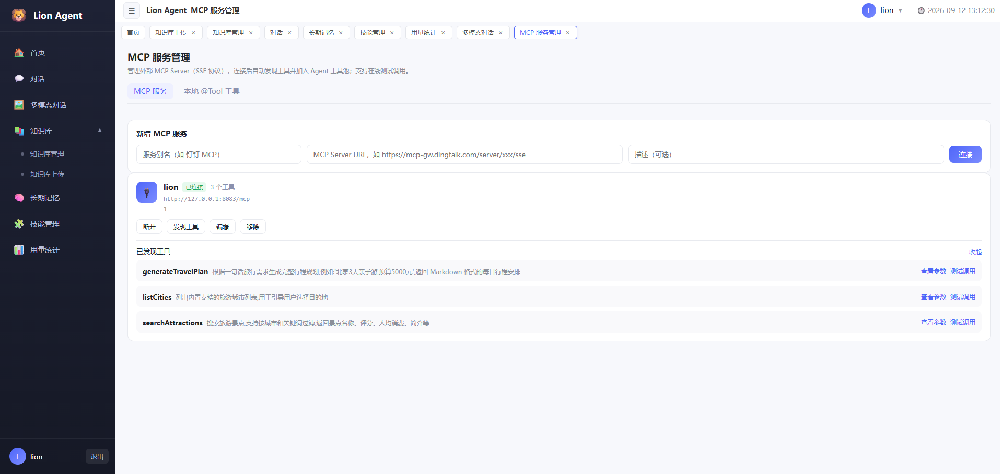

# Lion Agent

基于 **Spring AI 2.0**（Spring Boot 4 / Java 21）的智能体（Agent）服务平台：文本/流式/多模态对话、知识库 RAG（入库→切分→多路召回→重排→门控）、语义缓存、跨会话长期记忆、自定义技能（动态工具）、多工具调用（含 MCP 远程工具）、Token 用量统计，并通过 OTel + Langfuse 原生摄取实现全链路可观测（含对话评分）；配套 Vue 3 后台前端（独立首页 + 标签页导航 + 用户设置）。

## 功能总览

| 模块 | 说明 |
| --- | --- |
| 智能对话 | 文本（同步/SSE 流式）+ 多模态（图文）双通道，会话支持重命名/删除/清空 |
| 知识库 RAG | 上传（txt/md/pdf/doc/docx）→ Tika / PDFBox 解析 → 7 种切分策略（含 PDF 按页切分）→ Milvus 向量化（全异步）；问答走「意图识别→语义改写→多路召回→RRF→Rerank→门控」流水线，支持引用溯源 |
| 高级 RAG 兜底 | 语义缓存（相似问题秒回 + 省 token）、Advisor 链（TokenUsage / Summary / QaCache） |
| 多轮与长期记忆 | 会话内多轮记忆 = JDBC 滑动窗口原文 + 增量压缩摘要双通路（含 100 条触发阈值、最近 5 条原文保精度）；跨会话用户画像（事实/偏好）由 LLM 抽取、Milvus 检索注入 |
| 工具调用 | 三层收敛（常驻 + 权限 + 向量预筛）的 RAG of Tools；内置日期/用户/星座/天气等工具 + MCP Server/Client |
| 自定义技能 | 页面维护「提示词模板 + 参数」，运行期动态构建为 ToolCallback，内置 7 个种子技能，支持试跑与导出 |
| 用量与可观测 | Token 用量统计（用户/会话/模型维度）+ OpenTelemetry→Langfuse 全链路 Trace + 原生摄取能力（对话满意度评分 / 自定义事件补报，含演示接口） |
| 账号体系 | 注册/登录（BCrypt + Sa-Token），个人资料（昵称/头像）与密码自助修改 |

## 项目效果图










## 技术栈

| 分类 | 技术 |
| --- | --- |
| 语言/框架 | Java 21、Spring Boot 4.0.7、Spring AI 2.0.1 |
| 数据 | MySQL 8 + MyBatis-Plus 3.5、Redisson（Redis）、Milvus 向量库 |
| 模型 | 通义千问 DashScope（OpenAI 兼容）：qwen 系列对话 + text-embedding-v3（1024 维） |
| 文档解析 | Apache Tika（pdf / doc / docx / txt / md） |
| 认证 | Sa-Token（自定义 HandlerInterceptor） |
| 工具 | Hutool（JSON 序列化）、Resilience4j（熔断）、springdoc-openapi（Swagger UI） |
| 远程工具 | MCP（本服务提供 streamable-http Server，同时以 Streamable HTTP Client 接入第三方 MCP Server） |
| 可观测性 | Actuator + OpenTelemetry → Langfuse（OTLP）；自研 `LangfuseIngestClient` 原生摄取（评分 / 自定义事件） |
| 前端 | Vue 3 + Vite（`frontend/` 目录） |

## Spring AI 知识点速览（本项目落点）

项目基于 Spring AI 2.0（`spring-ai.version=2.0.1`，适配 Spring Boot 4 / Java 21）通过 OpenAI 兼容协议接入通义千问 DashScope。下表按官方能力域罗列**项目实际用到的 Spring AI 概念及落点代码**（机制细节见「核心设计」，下文简写的「见 x.y」同样指核心设计的对应小节），可作为复习与检索索引。

**1. 模型与调用入口**

| Spring AI 概念 | 说明 | 本项目落点 |
| --- | --- | --- |
| `ChatModel` | 对话模型抽象（同步） | OpenAI 兼容自动配置指向 DashScope（`qwen3.8-max`）；辅助链路（意图识别 / 改写 / Rerank / 门控 / 记忆抽取 / 技能执行）注入**裸 `ChatModel`**，绕开全局 Advisor 链 |
| `ChatClient` | 业务门面：`prompt().system().user().media().tools().advisors().call()/stream()` | `AiConfig#chatClient`（全局，挂 Advisor 链）、`AiConfig#multimodalChatClient`（多模态独立链路） |
| `ChatOptions` | 模型参数（model / temperature） | 多模态用 `.defaultOptions(...)` 切到 `qwen-vl-max`，不新增 ChatModel Bean |
| `UserSpec#media(MimeType, Resource/URL)` | 多模态图片输入 | `ChatServiceImpl`（`images` 文件 + `imageUrls` 链接两种重载） |
| `EmbeddingModel` | 向量化抽象 | text-embedding-v3（1024 维）：知识库 / 工具 / 技能 / 语义缓存 / 长期记忆 5 处向量化共用 |
| `PromptTemplate` | ST4 模板渲染 | `PromptConfig`（`prompts/*.st`，DB 优先 + classpath 回退，页面改提示词即时生效） |
| 结构化输出 | `.entity(Class)` / `.entity(ParameterizedTypeReference)` / 原生 provider 模式 | `controller/test/StructTestController` + `AdvisorParams.ENABLE_NATIVE_STRUCTURED_OUTPUT` |

**2. Advisor 体系**

| Spring AI 概念 | 说明 | 本项目落点 |
| --- | --- | --- |
| `CallAdvisor` / `StreamAdvisor` + `CallAdvisorChain` / `StreamAdvisorChain` | 同步与流式两条调用链，`order` 越小越靠外层 | 4 个自研 Advisor 同时实现两接口：`TokenUsageAdvisor`(-100) / `QaCacheAdvisor`(10) / `LongTermMemoryAdvisor`(200) / `ConversationSummaryAdvisor`(300) |
| `ChatClientRequest` / `ChatClientResponse` | 链上请求与响应载体 | 自研 Advisor 借此改写 messages（注入 SystemMessage 摘要/画像）、读写 `adviseContext` |
| `MessageChatMemoryAdvisor` | 官方会话记忆注入 Advisor | `AiConfig`（order 0）+ 自研 `ReadLimitChatMemory` 控制读取条数 |
| `SimpleLoggerAdvisor` | 请求 / 响应日志 | 全局链内置（order 0） |
| `ToolCallingAdvisor` | 工具调用循环宿主（可被子类替换） | 被 `ToolSearchToolCallingAdvisor` 接管（见 3.1） |
| `AdvisorParams` | 官方 Advisor 参数常量 | 原生结构化输出开关 |

**3. ChatMemory（会话记忆）**

| Spring AI 概念 | 本项目落点 |
| --- | --- |
| `ChatMemory` / `MessageWindowChatMemory` | 短程滑动窗口：落库 `maxMessages(500)`、读时注入 30 条，见 1.2 |
| `JdbcChatMemoryRepository` | Spring AI JDBC 记忆仓库（`spring.ai.chat.memory.repository.jdbc.initialize-schema`） |
| 自研长程通路 | `ConversationSummaryAdvisor` 基于业务表 `chat_message` + 摘要游标做增量压缩，不依赖 Spring AI 内存仓库 |
| `ChatMemory.CONVERSATION_ID` | 会话 ID 经 `.advisors(a -> a.param(...))` 注入，工具搜索顾问也复用它做会话隔离 |

**4. RAG（Document / Reader / Splitter / VectorStore）**

| Spring AI 概念 | 本项目落点 |
| --- | --- |
| `Document` | 切分产物、向量写入与检索结果的统一载体（metadata 带 knowledgeId / docId / fileName / page） |
| `TextSplitter` / `TokenTextSplitter` | 7 种切分策略：`token` 用官方 `TokenTextSplitter`，其余 6 种自研实现 `TextSplitter` |
| `TikaDocumentReader` | txt / md / pdf / doc / docx 抽纯文本（入库链路第一步） |
| `PagePdfDocumentReader` + `PdfDocumentReaderConfig` + `ExtractedTextFormatter` | PDF 按页切分（按页边距裁页眉 / 页脚），见 2.2 |
| `VectorStore` / `MilvusVectorStore` | 默认 `VectorStore` Bean（Milvus 自动配置）供知识库检索；各业务向量库（工具 / 技能 / 语义缓存 / 长期记忆）统一走 `LazyMilvusVectorStore` 懒加载且**不注册成 Bean** |
| `SearchRequest` | 相似度检索：工具预筛 top-3 + 权限 `filterExpression`、知识库多路召回、语义缓存（0.78）、长期记忆（0.55） |
| 检索增强（自研，非 Spring AI API） | `service/retriever/`：`SemanticRetriever` / `QueryRewriteRetriever` / `MultiRouteRetriever` / `Bm25Retriever` + RRF 融合 + `DashScopeRerankUtils` + 门控；知识库问答流水线见 2.3 |

**5. Tool Calling（工具调用）**

| Spring AI 概念 | 本项目落点 |
| --- | --- |
| `@Tool` / `@ToolParam` | 声明式工具：`UserTools` / `DateTools` / `StarFortuneTools` / `TimeLimiterTools` |
| `ToolCallbacks.from(bean)` | 反射把 `@Tool` 方法收集为 `ToolCallback[]`（`ToolRegistryService`） |
| `ToolCallback` / `ToolDefinition` / `DefaultToolDefinition` | 工具统一契约（name / description / inputSchema）；自研 `ToolCallbackBuilder` 用于动态构建技能工具 |
| `MethodToolCallback` | 编程式工具（反射绑定既有方法 + 手写 inputSchema）：`CustomToolsConfig#weatherTool` |
| `FunctionToolCallback` | 函数式工具（`inputType(record)` 自动生成 JSON Schema）：`CustomToolsConfig#holidayCountdownTool` |
| `ToolCallbackProvider` | 远程（MCP）工具供给，`ToolRegistryService` 用 `ObjectProvider` 可选注入 |
| `ToolCallingManager` | 工具执行管理器（工具搜索顾问 Builder 需显式传入） |
| `.tools(List<ToolCallback>)` | 每请求按需注册（常驻 + 向量预筛 + 技能命中），避开已弃用的 `toolCallbacks(...)` 重载 |
| `ToolIndex` / `ToolSearchTool` / `ToolSearchToolCallingAdvisor` | 工具搜索（渐进式工具披露）：3 种索引实现 + 会话隔离 + 淘汰策略，见 3.1 |

**6. MCP（Model Context Protocol）**

| Spring AI 概念 | 本项目落点 |
| --- | --- |
| `spring-ai-starter-mcp-server-webmvc` + `@McpTool` / `@McpToolParam` | 本服务内置 streamable-http Server（`/mcp`）：`tools/mcptool/OrderMcpTools` |
| `spring-ai-starter-mcp-client-webflux` + `ToolCallbackProvider` | yml 静态配置的第三方 MCP Server 工具接入，同样参与向量索引与熔断保护 |
| MCP 官方 SDK（`McpClient` / `McpSyncClient` / `HttpClientStreamableHttpTransport`）+ `McpToolUtils.getToolCallbacksFromSyncClients` | 页面动态增删 MCP Server：运行期建连、`listTools`、转 `ToolCallback` 后触发索引重建（`McpServerServiceImpl`）；SSE 传输已被 MCP 规范与 Spring AI 2.0 废弃，统一用 Streamable HTTP |

**7. 可观测与版本对齐**

| Spring AI 概念 | 本项目落点 |
| --- | --- |
| Observation / OTel | `spring-boot-starter-actuator` + `spring-boot-starter-opentelemetry`：Spring AI 调用自动埋点 → OTLP → Langfuse（见「核心设计 4」） |
| `Usage` / `ChatResponseMetadata` | `TokenUsageAdvisor` 从中取输入/输出 token 与耗时落库 `ai_token_usage` |
| `@ConditionalOnMissingBean` Bean 让路 | 自定义 `ToolCallingAdvisor.Builder` 覆盖自动配置（工具搜索顾问，见 3.1）；自定义 `ToolIndex` Bean 同样优先 |
| 依赖版本对齐坑 | `spring-ai-client-chat` 传递的 `swagger-annotations-jakarta` 覆盖 springdoc 所需版本（显式钉 `2.2.52`）；`openai-java-core` 传递 javax 版 `swagger-annotations`（exclusion 排除） |

## 项目结构

```
lion-agent/
├── src/main/java/com/lion/agent/
│   ├── advisor/            # Advisor 链：TokenUsage / ConversationSummary / QaCache / Memory 注入
│   ├── common/             # Result、PageResult、枚举、异步队列组件（async/：RedisTaskQueue + AbstractRedisTaskConsumer）
│   ├── config/             # AiConfig、PromptConfig（st 模板）、SaTokenConfig、线程池等
│   ├── controller/         # Auth / Chat / Conversation / Knowledge / Document / Memory / Skill / TokenUsage
│   │   └── test/           # LangfuseTestController（评分/摄取手工调试）
│   ├── dto/                # 请求体与任务消息（Register / Login / Skill / UpdateProfile / UpdatePassword / DocumentProcessTask）
│   ├── entity/             # User / Conversation / ChatMessage / ConversationSummary / KnowledgeBase /
│   │                       # KnowledgeDocument / AiMemory / Skill / TokenUsage
│   ├── exception/          # 全局异常（BusinessException + 统一处理）
│   ├── mapper/             # MyBatis-Plus Mapper
│   ├── service/
│   │   ├── impl/           # 业务实现（Chat / KnowledgeDocument / KnowledgeRetrieval / Memory / Skill ...）
│   │   ├── async/          # DocumentProcessConsumer（Redis 异步消费者）
│   │   ├── retriever/      # 检索增强（Rerank 等）
│   │   └── *.java          # 核心服务：ChatService / IntentRecognitionService / QaCacheService /
│   │                       # KnowledgeRetrievalService / MemoryExtractor / MemoryService /
│   │                       # SkillToolRegistry / ToolRegistryService / WeatherService ...
│   ├── tools/              # DateTools / UserTools / StarFortuneTools / TimeLimiterTools / ToolCallbackBuilder / mcptool/
│   ├── utils/              # LangfuseIngestClient（原生摄取+评分）/ DashScopeRerankUtils / MilvusQueryUtils
│   └── vo/                 # 返回视图对象
├── src/main/resources/
│   ├── application*.yml    # 按环境拆分（dev / prod），敏感项走环境变量
│   ├── db/init.sql         # 建库建表 + 内置技能种子数据
│   └── prompts/*.st        # 提示词模板（意图识别 / 记忆抽取 / 改写 / 重排 / 门控 等）
├── frontend/               # Vue 3 前端（views / components / api / router）
│   ├── src/views/          # Login / Home / Chat / MultimodalChat / knowledge/ / memory / skill/ / usage
│   ├── src/components/     # UserProfileModal / ConfirmDialog / InputDialog / PaginationBar
│   └── src/api/            # auth / chat / knowledge / memory / skill / token-usage
├── docs/images/            # README 效果图（截图存放目录）
├── docker-compose.yml      # MySQL / Redis / etcd / MinIO / Milvus / Attu 一键编排
├── start-frontend.bat      # Windows 前端一键启动脚本
├── .env / .env.example     # 本地敏感配置（.env 不提交）
└── pom.xml
```

## 快速开始

```bash
# 1. 环境要求：JDK 21、Maven 3.8+、Docker（可选，用于一键启动中间件）
#    - 方案 A（推荐）：用 Docker Compose 一键启动 MySQL / Redis / Milvus
#      docker compose up -d
#    - 方案 B：自行安装 MySQL 8 / Redis / Milvus（见下方「中间件环境准备」）

# 2. 初始化数据库（方案 B 需要；方案 A 已由 MySQL 容器自动执行 init.sql）
mysql -uroot -p lion_agent < src/main/resources/db/init.sql

# 3. 配置敏感信息：复制模板为 .env 并填入真实值
cp .env.example .env
# 必填：QWEN_API_KEY（通义千问）；DB_USERNAME / DB_PASSWORD / REDIS_PASSWORD 等见 .env.example
# 若中间件跑在 Docker 里（方案 A），MILVUS_HOST 等保持 localhost 即可

# 4. 启动后端（默认激活 dev 环境）
mvn spring-boot:run
# 或指定环境：mvn spring-boot:run -Dspring-boot.run.profiles=prod

# 5. 启动前端
cd frontend && npm install && npm run dev
```

- Swagger UI：`http://localhost:8080/swagger-ui.html`
- 前端页面：`http://localhost:5173`

## 中间件环境准备（手动部署 / Docker Compose）

Lion Agent 依赖 MySQL、Redis、Milvus 三类核心中间件（Milvus 自身依赖 etcd + MinIO 做元数据和对象存储）。提供两种部署方式，任选其一即可：

- **推荐**：`docker compose up -d` 一键启动本章节「方式二」中的全部容器。
- **手动部署**：已有现成中间件或想自定义安装，参考「方式一」。

### 版本与端口总览

| 中间件 | 版本要求 | 端口 | 本项目用途 |
| --- | --- | --- | --- |
| MySQL | 8.0+ | 3306 | 业务数据：会话、消息、会话摘要、知识库与文档元数据 |
| Redis | 6.0+（建议 7.x） | 6379 | Sa-Token 会话、语义缓存、异步任务队列（`document:process`） |
| Milvus | **2.4.x**（须与 yml 索引/维度一致） | 19530（gRPC）/ 9091（健康检查） | 知识库 RAG 向量检索 + 语义缓存向量存储 |
| MinIO | 与 Milvus 配套版本 | 9000 / 9001 | Milvus 底层对象存储（standalone 依赖） |
| etcd | v3.5+ | 内部（2379） | Milvus 元数据存储（standalone 依赖） |

### 方式一：手动部署

不借助 Docker 时，需自行安装以下中间件并满足版本要求。

#### MySQL 8

```bash
# 1. 安装 MySQL 8.0+，启动服务
# 2. 创建数据库与账号（账号密码对应 .env 的 DB_USERNAME / DB_PASSWORD）
mysql -uroot -p -e "
CREATE DATABASE IF NOT EXISTS lion_agent DEFAULT CHARACTER SET utf8mb4 COLLATE utf8mb4_unicode_ci;
CREATE USER IF NOT EXISTS 'xxkfz'@'%' IDENTIFIED BY 'xxkfz';
GRANT ALL PRIVILEGES ON lion_agent.* TO 'xxkfz'@'%';
FLUSH PRIVILEGES;"
# 3. 执行初始化脚本（含建表）
mysql -uxxkfz -p lion_agent < src/main/resources/db/init.sql
```

#### Redis

- **用途**：① Sa-Token 会话 token 存储；② 语义缓存（`lion.qa-cache` 相关 key）；③ 知识库异步任务队列（key 前缀 `lion:task:queue:`）。
- 若设置了密码，需在 `.env` 配置 `REDIS_PASSWORD`，且务必开启持久化（AOF 或 RDB），否则重启会丢队列任务与缓存。
- 验证：`redis-cli -a <密码> ping` 返回 `PONG`。
- Windows 本机可用 Memurai 或 WSL 运行；Linux 用 `apt install redis-server` / Docker。

#### Milvus 向量数据库

- **架构**：Milvus standalone 依赖 etcd（元数据）+ MinIO（对象存储）两个进程，`docker-compose.yml` 已按官方架构拆分部署。
- **集合（collection）与维度对齐（关键）**：
  - `lion_agent_knowledge`（dev 默认 `lion_base_docs`）：知识库文档向量，**1024 维，COSINE 度量**——必须与 DashScope `text-embedding-v3` 输出维度一致；默认 collection 名可通过 yml `lion.knowledge.collection-name` 覆盖。
  - `lion_agent_qa_cache`：语义缓存专用集合（yml `lion.qa-cache.collection-name`），与知识库物理隔离。
  - `lion_agent_tool_index`：工具索引 + 技能索引共用集合（yml `lion.tool-index.collection-name` 与 `lion.skill-index.collection-name`，默认均指向此集合）。库内按 `type=tool_index / skill_index` 隔离，重建时按 type 清空重建，不影响知识库；工具/技能之间也互不干扰。
  - `lion_agent_memory`：长期记忆专用集合（yml `lion.memory.collection-name`），与知识库物理隔离。
  - 若手动预建过集合，需保证维度/度量一致，否则写入报错。
- 验证：`curl http://localhost:9091/healthz` 返回 `OK`；或用 Attu 管理台 `http://localhost:8000` 查看集合数据。
- 升级 Milvus 大版本前先确认索引类型（本项目使用 AUTOINDEX / COSINE）兼容。

#### 验证命令汇总

```bash
# MySQL
mysql -uxxkfz -p -h127.0.0.1 -e "select 1"
# Redis
redis-cli -a 123456 ping        # 期望 PONG
# Milvus
curl http://localhost:9091/healthz   # 期望 OK
```

### 方式二：Docker Compose 一键部署（推荐）

项目根目录提供 `docker-compose.yml`，一键编排全部基础设施（MySQL / Redis / etcd / MinIO / Milvus / Attu，即上述中间件的容器化等价方案）。

#### 前置环境条件

| 依赖 | 版本要求 | 说明 |
| --- | --- | --- |
| Docker Engine | 20.10+ | `docker --version` 查看 |
| Docker Compose | v2 | `docker compose version` 查看 |
| 端口 | 见下表 | 启动前确认未被占用 |

启动前确认以下端口未被占用：`3306`(MySQL)、`6379`(Redis)、`19530/9091`(Milvus)、`9000/9001`(MinIO)、`8000`(Attu)。

#### 服务清单

| 服务 | 镜像 | 对外端口 | 说明 |
| --- | --- | --- | --- |
| `mysql` | mysql:8.0 | 3306 | 业务库 `lion_agent`，首次启动自动执行 `init.sql` 建表 |
| `redis` | redis:7.4-alpine | 6379 | 会话 / 缓存 / 异步任务队列，AOF 持久化 |
| `etcd` | quay.io/coreos/etcd:v3.5.5 | —（内部） | Milvus 元数据存储 |
| `minio` | minio/minio | 9000/9001 | Milvus 对象存储，控制台 `http://localhost:9001`（minioadmin/minioadmin） |
| `milvus-standalone` | milvusdb/milvus:v2.4.17 | 19530/9091 | 向量库，`19530` 为应用连接端口，`9091` 健康检查 |
| `attu` | zilliz/attu:latest | 8000 | Milvus Web 管理台（可选），`http://localhost:8000` |

#### 启动与停止

```bash
docker compose up -d              # 启动全部中间件（含 Attu 管理台）
docker compose up -d mysql redis milvus-standalone   # 只启动需要的
docker compose ps                 # 查看状态，等待 healthy
docker compose logs -f milvus-standalone             # 查看日志

docker compose down               # 停止，保留数据
docker compose down -v            # 停止并删除全部数据卷（慎用，会清空数据）
```

#### 数据持久化与初始化

- 数据保存在命名卷：`mysql-data`、`redis-data`、`etcd-data`、`minio-data`、`milvus-data`，`docker compose down` 不丢失。
- MySQL 首次启动会挂载 `src/main/resources/db/init.sql` 到容器初始化目录自动建库建表；如需重建，先 `docker compose down -v` 清卷再 `up -d`。
- 镜像版本说明：Milvus 需与 `application*.yml` 中 `embedding-dimension: 1024`、索引类型一致；本项目已使用 Milvus 2.4（AUTOINDEX / COSINE），升级大版本前请先验证兼容性。

### 应用连接配置

中间件连接信息与项目 `.env` 完全对齐（Compose 自动读取 `.env` 中的 `DB_USERNAME` / `DB_PASSWORD` / `REDIS_PASSWORD` 等变量）。**注意**：当前 `.env` 中 `MILVUS_HOST=118.25.109.72` 是远程测试实例，改用本地容器时需改为：

```properties
MILVUS_HOST=localhost
MILVUS_PORT=19530
# DB_URL 默认即 localhost:3306，无需改动
```

### 应用容器化（可选，暂未提供）

当前 Compose 只编排**中间件**，应用仍在本机以 `mvn spring-boot:run` 运行。如需将后端/前端一并容器化部署（`Dockerfile` + Compose service），请基于 `application-prod.yml`（全部走环境变量）扩展，并将 Compose 网络接入本编排。

## 配置管理

敏感信息与部署差异项全部通过**环境变量**注入，不写死在 yml 中。

**加载优先级**：系统环境变量 > 项目根目录 `.env` 文件 > `application*.yml` 内默认值。

`.env` 由 `application.yml` 中 `spring.config.import: optional:file:.env[.properties]` 加载，已加入 `.gitignore`，**禁止提交**；新增变量请同步维护 `.env.example` 模板。

| 变量 | 说明 |
| --- | --- |
| `DB_URL` / `DB_USERNAME` / `DB_PASSWORD` | MySQL 连接；`DB_ROOT_PASSWORD` 仅供 docker compose 容器初始化 |
| `REDIS_PASSWORD` | Redis 密码（无密码留空） |
| `QWEN_API_KEY` | 通义千问 DashScope API Key（必填） |
| `QWEN_BASE_URL` / `QWEN_MODEL` | 可选：覆盖 DashScope 地址与对话模型（默认 `qwen3.8-max`） |
| `LION_MULTIMODAL_MODEL` | 可选：多模态模型（默认 `qwen-vl-max`） |
| `LION_ALAPI_TOKEN` | ALAPI Token（星座运势等第三方接口，可选） |
| `MILVUS_HOST` / `MILVUS_PORT` / `MILVUS_DATABASE` / `MILVUS_COLLECTION` | Milvus 连接与 collection |
| `LANGFUSE_OTLP_ENDPOINT` / `LANGFUSE_OTLP_AUTH` | Langfuse OTLP 端点与 Basic Auth（`base64(pk:sk)`），链路追踪 |
| `LANGFUSE_BASE_URL` / `LANGFUSE_PUBLIC_KEY` / `LANGFUSE_SECRET_KEY` | Langfuse 原生摄取（对话评分/自定义事件补报）公钥私钥，可选 |
| `LION_UPLOAD_PATH` | 文件上传目录（默认 `upload/`） |

业务开关（yml）：

| 配置 | 默认值 | 说明 |
| --- | --- | --- |
| `lion.qa-cache.enabled` | `true` | 语义缓存总开关 |
| `lion.qa-cache.threshold` | `0.78` | 命中相似度阈值（0.75~0.80 合理，过高会永远命中不了） |
| `lion.qa-cache.collection-name` | `lion_agent_qa_cache` | 语义缓存专用 Milvus collection（与知识库物理隔离） |
| `lion.async.consume-threads` | `2` | 异步队列消费线程数 |
| `lion.async.max-retry` | `3` | 文档处理失败最大重试次数 |
| `lion.advisor.token-usage-order` | `-100` | Token 用量统计 Advisor 调用链顺序（order 越小越靠外层） |
| `lion.advisor.qa-cache-order` | `10` | 语义缓存 Advisor 调用链顺序（在会话记忆之前，命中可短路） |
| `lion.advisor.long-term-memory-order` | `200` | 长期记忆 Advisor 调用链顺序 |
| `lion.advisor.conversation-summary-order` | `300` | 会话记忆摘要 Advisor 调用链顺序（摘要阈值 100、保留原文 5 条当前硬编码于 `AiConfig`，见 1.2） |
| `lion.prompt.agent-name` | `Lion Agent` | 系统提示词中的 Agent 角色名（渲染模板变量 `{agentName}`） |
| `lion.token-usage.executor.core-pool-size` | `2` | Token 用量落库异步线程池核心线程数 |
| `lion.token-usage.executor.max-pool-size` | `8` | 线程池最大线程数 |
| `lion.token-usage.executor.queue-capacity` | `1024` | 线程池队列容量（满时调用线程同步兜底，保证不丢统计） |
| `lion.token-usage.executor.keep-alive-seconds` | `60` | 非核心线程空闲回收时间（秒） |

## 数据库表

| 表 | 说明 |
| --- | --- |
| `sys_user` | 用户（含昵称、头像；密码 BCrypt） |
| `chat_conversation` | 会话（支持重命名/删除/清空） |
| `chat_message` | 消息（`user` / `assistant`），多轮记忆的唯一落库来源 |
| `chat_conversation_summary` | 会话摘要，多版本保留（`version` + `last_message_id` 增量游标） |
| `knowledge_base` | 知识库 |
| `knowledge_document` | 文档，`status`：0 失败 / 1 成功 / 2 处理中，失败原因记录在 `fail_reason` |
| `ai_token_usage` | Token 用量统计，`TokenUsageAdvisor` 每次模型调用后写入（用户 / 会话 / 模型 / 输入输出 token / 耗时） |
| `ai_memory` | 用户长期记忆（MySQL 侧原文：类型 fact/preference、重要性 1-5、来源会话），向量在 Milvus `lion_agent_memory` |
| `ai_skill` | 自定义技能（提示词模板 `{{param}}` 占位符 + 参数 JSON，`user_id=0` 为内置全局种子技能） |

## 核心设计

### 1. 对话链路（文本 / SSE 流式 / 多模态）

```
用户消息 → 落库 chat_message → Advisor 链 → 模型调用 → 回复落库 + 写语义缓存
```

- **多轮记忆**：会话内多轮记忆由「JDBC 滑动窗口原文（短程）」与「`chat_message` 全量 + 增量压缩摘要（长程）」双通路共同提供，完整机制见 1.1 / 1.2。
- **语义缓存**（`QaCacheAdvisor` + `QaCacheService`）：问题先做向量检索，与历史问题相似度 ≥ 阈值（默认 0.78）直接复用历史回答——省 token、秒回、答案一致；按 `userId` 隔离；Milvus 故障自动降级跳过缓存，不影响主流程。
- **多模态**：`POST /api/chat/multimodal`，`multipart/form-data` 上传 `message` + `images`（多张）/ `imageUrls`，图文一起发送给多模态模型。

#### 1.1 Advisor 调用链（order 越小越靠外层、越先执行请求侧逻辑）

由 `AiConfig` 统一装配（order 可用 `lion.advisor.*-order` 调整）：

| order | Advisor | 职责 |
| --- | --- | --- |
| `-100` | `TokenUsageAdvisor` | Token 用量统计（最外层，拿到最终响应后落库 `ai_token_usage`） |
| `0` | `SimpleLoggerAdvisor` / `MessageChatMemoryAdvisor` | 请求日志；从 JDBC `ChatMemory` 读取该会话最近窗口原文注入 prompt（本轮问答响应后写回） |
| `10` | `QaCacheAdvisor` | 语义缓存（相似问题命中直接短路，跳过记忆注入与模型调用） |
| `200` | `LongTermMemoryAdvisor` | 跨会话用户画像（Milvus 检索注入 System Prompt） |
| `300` | `ConversationSummaryAdvisor` | 会话摘要：以 `chat_message` 全量为源做增量压缩，注入长程摘要 + 最近原文 |

要点：`MessageChatMemoryAdvisor`（order 0）先于 `ConversationSummaryAdvisor`（order 300）执行，因此**摘要 Advisor 拿到请求时，prompt 的 instructions 里通常已包含窗口记忆注入的历史**——两条记忆通路由此叠加生效（见 1.2）。

#### 1.2 会话记忆：窗口原文（短程）+ 增量摘要（长程）

项目对"会话内多轮记忆"采用**两套机制并存**（`AiConfig`）：

**通路 A——JDBC 滑动窗口（短程原文，`MessageChatMemoryAdvisor`）**

```java
ChatMemory messageWindowChatMemory(JdbcChatMemoryRepository repository) {
    return MessageWindowChatMemory.builder()
            .chatMemoryRepository(repository)
            .maxMessages(500)              // 每会话最多保留 500 条
            .build();
}
// 读取时用 ReadLimitChatMemory(chatMemory, 30) 截断：每次只注入最近 30 条
```

- 存储为 Spring AI 内部仓库表（JDBC 持久化，进程重启不丢），但本质是**滑动窗口**：超长历史会被窗口淘汰，没有"全量 + 游标"概念。
- 读时限制 30 条（`ReadLimitChatMemory`），响应完成后把本轮问答 `add` 写回。

**通路 B——`chat_message` 全量 + 增量压缩摘要（长程，`ConversationSummaryAdvisor`）**

```
每轮调用
  → ① 查 chat_message 该会话全部 user/assistant 消息（按 id 升序）
  → ② 以 chat_conversation_summary 最新版 last_message_id 为游标，筛出「游标之后的新增消息」
        ├ 新增条数 < summaryThreshold(默认 100) → 不做摘要调用，直接复用最新摘要
        └ 新增条数 ≥ 100 → 渲染「旧摘要 + 新增消息」(summary-merge.st / summary-compress.st 模板)，
             用不含本 Advisor 的干净 ChatClient 生成新摘要 → 落库 version+1、游标前移至最新消息
  → ③ 注入内容 = [SystemMessage 对话历史摘要] + 最近 keepRecentCount(默认 5) 条原始消息
```

两个参数的含义（当前硬编码于 `AiConfig`，非 yml 开关）：

| 参数 | 含义 | 当前值 | 调大 / 调小的影响 |
| --- | --- | --- | --- |
| `summaryThreshold` | 触发一次摘要压缩所需的「游标后新增消息条数」（省 token 的节流阀） | `100` | 调大：压缩少、省 token，但摘要更新慢；调小：压缩勤、记忆更及时，token 花费更多 |
| `keepRecentCount` | 压缩后仍逐字保留的「最近 N 条原始消息」注入给模型 | `5` | 调大：近程上下文更准，token 更多；调小：更省 token，但最近几轮可能被压进摘要丢细节 |

设计意图：**摘要保长程（老内容低成本携带），原文保近程（最近几轮一字不差）**；增量压缩只在游标后消息攒够阈值时发生一次，且摘要生成走独立的干净 `ChatClient`，避免摘要请求递归触发自身。

> 注意：通路 A（窗口 30 条）与通路 B（摘要 + 最近 5 条）当前同时生效，最近几轮原文会被**重复注入**（有一定 token 冗余）。`ConversationSummaryAdvisor` 类注释已声明"基于业务表 chat_message，不再依赖 Spring AI 内存仓库"——若确认新方案独活，可考虑从 `AiConfig` 链中摘除 `MessageChatMemoryAdvisor` 通路 A。

### 2. 知识库 RAG 完整流程（入库 → 切分 → 检索 → 作答）

#### 2.1 文档入库（上传 → 解析 → 切分 → 向量化，异步化）

整条链路异步化，上传接口秒回：

```
上传接口 POST /api/knowledge/{knowledgeId}/documents
  → 校验（知识库归属 / 文件类型白名单：txt、md、pdf、doc、docx）
  → 落盘 upload/{knowledgeId}/{yyyy/MM}/{uuid}_{原文件名}（库中存绝对路径）
  → 插入元数据 knowledge_document（status=2 处理中）
  → 任务入队 Redis 队列 document:process（DocumentProcessTask：docId / knowledgeId / filePath / splitter）
  → 立即返回
```

消费者 `DocumentProcessConsumer`（N 线程 BRPOP）：

```
取任务 → Redis SETNX 幂等锁（防同一文档并发处理）
      → 幂等检查（status=1 直接跳过，防重复消费）
      → splitDocument 按所选策略「解析 + 切分」（见 2.2），分两条分支：
          · 文本切分型：TikaDocumentReader 抽纯文本 → 策略切分（FileSystemResource 读取，兼容中文文件名）
          · 解析型（PDF 按页）：文件直接交给策略，由 PDFBox 按页提取（页边界只在原文里有，纯文本已丢失）
      → metadata 携带 knowledgeId / docId / fileName（按页切分额外带 page 页码，供引用溯源标注来源页）
      → 分批（10 条/批，DashScope embedding 单次上限）embedding 写入 Milvus（yml `lion.knowledge.collection-name`，1024 维 / COSINE）
      → status=1 成功
失败：retryCount < max-retry(默认3) 重新入队，否则 status=0 + fail_reason（前端列表/预览展示具体报错）
```

通用组件位于 `common/async`：`RedisTaskQueue`（生产者，Hutool `JSONUtil` 序列化）、`AbstractRedisTaskConsumer`（消费者基类，N 线程轮询 + 优雅关闭）。任务保存在 Redis 队列中，重启期间保留、重启后继续消费。

#### 2.2 切分策略（splitter）

上传时可指定 `splitter` 参数，默认 `token`：

| 策略 | 实现 | 说明 | 适用场景 |
| --- | --- | --- | --- |
| `token`（默认） | Spring AI `TokenTextSplitter` | 按 token 切分 | 通用兜底 |
| `recursive` | 递归切分，优先级 段落→句子→短句→空白，单块 ≤3000 字符（约 800 token） | 保语义优先级切分，块大小可控 | 结构化长文档 |
| `paragraph` | 空行（`\R\s*\R`）分段 | 按自然段切，块较大 | 条例、规章制度 |
| `sentence` | 中英文标点（`。！？!?.；;`）断句 | 块短、粒度细 | 问答密集的短文本 |
| `line` | 按行切（trim 空行） | 块最小 | 代码、清单类 |
| `semantic` | 先断句 → embedding 计算相邻句相似度 → 在语义断裂处（低于阈值）切分 | 块内语义连贯，检索质量最高 | 长文、专业资料（embedding 成本高） |
| `page` | Spring AI `PagePdfDocumentReader`（PDFBox）按页提取，默认一页一块，可用页边距裁掉页眉/页脚 | 块与「页」严格对齐，块上带 `page` 页码元数据 | **仅 PDF**：说明书、论文、合同等「一页一主题」的规范文档 |

**两类策略**（`DocumentSplitterStrategy`）：

- **文本切分型**（除 `page` 外的 6 种）：只依赖文本内容，调用方先解析成纯文本，再调 `split(List<Document>)`；
- **解析型**（`page`）：分块依据在原始文件结构里（PDF 页码），纯文本已丢失该信息，故覆写 `parseFromSource()` 返回 `true`，
  由调用方改调 `parseAndSplit(Resource)` 直接读落盘文件；`split()` 保留为兜底实现（被误调时告警并原样返回，不静默产出错块）。

**扩展方式**：新增策略 = 新增一个 `@Component` 实现类并声明 `type()`（枚举 `SplitterType`），注册表 `SplitterStrategyRegistry`
启动时自动收集，`KnowledgeDocumentServiceImpl.splitDocument` 无需改动；解析型策略再覆写 `parseFromSource()` / `parseAndSplit(Resource)` 即可。

**相关配置**（yml，未配置走代码内默认值）：

```yaml
lion:
  splitter:
    page:
      pages-per-document: 1   # 每块页数，1 = 一页一块
      top-margin: 0           # 上边距（磅），调大裁掉页眉
      bottom-margin: 0        # 下边距（磅），调大裁掉页脚
```

> 注意：`page` 仅支持 PDF；对非 PDF 文件选择该策略会在处理阶段失败，`fail_reason` 记录「按页切分仅支持 PDF 文件：xxx」；
> 扫描件（图片型 PDF）因提取不到文本会提示需先做 OCR。

#### 2.3 统一对话入口 + 意图识别（Advanced RAG 流水线）

一般对话与知识库问答统一走 `POST /api/chat/send` / `/api/chat/stream`（请求可带可选 `knowledgeId`，不传则检索用户全部知识库）：

```
用户问题（+ 可选 knowledgeId）
  → ① 意图分类：显式 LLM 分类（GENERAL / KNOWLEDGE）
       - 指定了 knowledgeId → 直接 KNOWLEDGE
       - 用户没有任何知识库 → 直接 GENERAL
       - 否则裸 ChatModel 按模板分类（失败降级 GENERAL）
  → ② 语义改写：LLM 将口语化问题改写为检索友好查询（失败回退原文）
  → ③ 扩容多路检索：原问题 + 改写问题各召回 TopK=20（扩大候选池）
  → ④ RRF 融合 + 粗筛：两路按 RRF 分数（1/(60+rank)）去重排序，保留前 10
  → ⑤ Rerank：LLM 按相关性打分（0-100）重排，取前 5（可替换为专用 Rerank API）
  → ⑥ 复评门控：LLM 判断资料是否足以作答；不足 → 降级返回「资料不足 + 缺失原因」
       （省掉一次主模型调用，防幻觉）
  → ⑦ 构造上下文 + prompt（引用片段拼接）
  → ⑧ 走全局 ChatClient 作答（带记忆 / 工具 / 语义缓存等 Advisor）→ answer + referencedChunks
```

设计要点：

- **意图识别路由**：`IntentRecognitionService` 三步分类（显式指定 → 无知识库 → LLM 分类），意图为 GENERAL 时完全不触发检索，保持普通对话的响应速度；
- **recall 扩容**：原问题 + 改写问题各取 TopK=20，两路合并扩大候选池，靠后置重排保证 precision；
- **RRF 融合**：两路结果按 Reciprocal Rank Fusion 加权去重，缓解单路召回偏差；
- **LLM Rerank 精挑**：Top10 → Top5，替代一次性小 TopK 的精度损失；
- **门控兜底**：资料明显不足时不再调用主模型，直接返回缺失信息，降低幻觉率；
- **辅助调用与主链路隔离**：意图分类 / 改写 / 重排 / 门控使用**无 Advisor 的裸 `ChatModel`**，避免经过全局 ChatClient 触发语义缓存、会话记忆等 Advisor（污染缓存、误耗 token）；
- **知识库隔离**：指定知识库时检索带 `filterExpression: knowledgeId == xxx`；不指定则 `knowledgeId in (...)` 检索用户全部知识库；
- **引用溯源**：回答同时返回 `referencedChunks` 引用片段列表，前端可展示来源。

### 3. 工具注册与筛选（三层收敛，RAG of Tools）

- **常驻工具**：`UserTools` 等高频率低成本工具不走检索，永远注册。
- **权限过滤**：`@ToolPermission` 标注的工具按权限码过滤候选池（当前未实现 `StpInterface`，默认全部公开，接入后自动生效）。
- **向量预筛**：用户 query 与工具描述算相似度 top-3 召回，再交给 function calling 精选。

索引与本体分离：Milvus 中只存工具"目录索引"（`type=tool_index`，独立 collection `lion_agent_tool_index`，与知识库/技能物理隔离——重建时按 type 清空不影响知识库向量），工具实现仍是 Spring Bean。新增工具 = 写工具类 + 在 `ToolRegistryService` 登记，启动自动重建索引。

MCP：本服务内置 streamable-http Server（`/mcp`），同时可作为 SSE Client 接入第三方 MCP Server（如商品分析），接入的工具同样参与向量索引与熔断保护。

#### 3.1 工具搜索顾问（ToolSearchToolCallingAdvisor，渐进式工具披露）

上面的三层收敛解决的是「**发请求前**选哪些工具」；官方 `ToolSearchToolCallingAdvisor`（`spring-ai-starter-tool-search-advisor`，2.0.1）解决的是「**对话过程中**工具定义要不要一直挂在模型眼前」，即 Anthropic 提出的**渐进式工具披露**（progressive tool disclosure）。

**工作机制**（顾问继承 `ToolCallingAdvisor`，重写工具调用循环的初始化钩子与每轮迭代钩子）：

1. 会话开始时，本轮注册的工具被索引进 `ToolIndex`，**首轮不发送任何业务工具定义**，只发内置 `toolSearchTool`；
2. 模型需要某能力时，用**自然语言**调用 `toolSearchTool`（描述"我要查什么"，而不是猜工具名）；
3. `ToolIndex` 检索命中后，命中的工具定义被**追加进对话**，下一轮迭代模型即可正常发起工具调用；
4. 工具执行仍由 `ToolCallingManager` 完成，结果照常回到模型——它只是把工具定义**延迟注入**原有循环，不是另一套执行链路。

**索引按会话隔离**：`ToolIndex` 的全部操作以 `sessionId` 为作用域（`indexTool` / `indexTools` / `search` / `clearIndex`），会话 ID 默认从 advisor context 的 `ChatMemory.CONVERSATION_ID` 键读取。项目在 `ChatServiceImpl` 里已经传了该键（`.advisors(a -> a.param(ChatMemory.CONVERSATION_ID, conversationId))`），所以会话隔离"免费"生效，无需额外代码。

**三种 ToolIndex 实现**（`spring.ai.chat.client.tool-search-advisor.tool-index-type`）：

| 值 | 实现 | 依赖 | 说明 |
| --- | --- | --- | --- |
| `regex`（默认） | `RegexToolIndex` | 无 | 关键词/正则匹配，适合工具名有严格命名约定，未显式配置时的默认实现 |
| `lucene` | `LuceneToolIndex` | Lucene core（starter 已内置） | 全文检索，默认最低分 0.25（`...lucene.min-score-threshold`），低于阈值静默丢弃 |
| `vector` | `VectorToolIndex` | 容器中存在 `VectorStore` Bean | **项目当前使用**：对工具名 + 描述做 embedding，查询同样 embedding 后取 top-K，对自然语言描述最友好 |

项目配置（`application.yml`）：

```yaml
spring:
  ai:
    chat:
      client:
        tool-search-advisor:
          # 开启后自动创建 ToolIndex（按 tool-index-type 选实现）与 ToolSearchAdvisorProperties
          enabled: true
          tool-index-type: vector   # 语义召回，复用容器中的 Milvus VectorStore Bean
          max-results: 5            # 单次 toolSearchTool 调用最多召回 5 个工具定义注入对话（null 时模型自决，内置描述提示为 5）
```

其他可用属性及默认值：`session-id-key-name`（`ChatMemory.CONVERSATION_ID`）、`system-message-suffix`（追加到 system message 的使用指引，默认加载内置模板 `DEFAULT_SYSTEM_PROMPT_SUFFIX.md`）、`reference-tool-name-accumulation`（`true`）、`advisor-order`（`HIGHEST_PRECEDENCE+300`，即比链中 `TokenUsageAdvisor` 的 `-100` 更靠外层）、`eviction.lru-max-sessions`（`1000`）、`eviction.ttl`（`null`，设置后改用 LRU+TTL 组合策略）。

> `reference-tool-name-accumulation` 默认 `true` 的语义值得注意：会话内**被搜索发现过的工具会一直保留在可用集合里**，披露是单调递增的（越聊工具越多，不会"用完即收"）；想改成"每轮只保留本轮命中"可设为 `false`。

**接入改造（`AiConfig#toolSearchToolCallingAdvisorBuilder`）**：自动配置在 `enabled=true` 时注册的 Builder Bean 类型是 `ToolCallingAdvisor.Builder<?>`，靠 `@ConditionalOnMissingBean` 顶掉默认的普通版 Builder，从而透明替换 `ToolCallingAdvisor`。但 2.0.0 的 `ChatClientAutoConfiguration` 与 `ToolSearchAdvisorAutoConfiguration` **声明了同名的 Bean 方法** `toolCallingAdvisorBuilder`，谁先注册谁生效——实测普通版（不含 `ToolIndex`、不做工具搜索）先注册，ToolSearch 版被跳过，表现为「断点打不到、工具索引从不写入」。项目的解法：在用户配置类（先于自动配置解析）主动声明一个 `ToolCallingAdvisor.Builder<?>` Bean——`ToolSearchToolCallingAdvisor.builder().toolIndex(toolIndex).toolCallingManager(toolCallingManager)` 并透传 `max-results`，两个自动配置的同名方法都因 `@ConditionalOnMissingBean` 让路，`ChatClient.Builder` 自然拿到 ToolSearch 版并自动挂上顾问，`chatClient` 的装配代码无需改动。

> 坑：该 Bean 依赖 `enabled=true` 时自动创建的 `ToolIndex` 与 `ToolSearchAdvisorProperties`，因此**把 `enabled` 改成 `false` 会导致启动失败**（依赖 Bean 缺失）；要关闭顾问，需连同 `AiConfig` 里的 Builder Bean 一起摘掉。

**与 3 节自研筛选的分工（两层，别混淆）**：

| 层次 | 生效位置 | 职责 | 数据落点 |
| --- | --- | --- | --- |
| 自研 `ToolRegistryService.selectTools` + `SkillToolRegistry` | 请求**进入 ChatClient 之前** | 常驻工具 ∪ 权限码过滤后的向量 top-3 ∪ 技能命中，再用 `.tools(...)` 注册本轮工具 | 独立 collection `lion_agent_tool_index`（懒加载、**刻意不注册成 Bean**） |
| 官方 `ToolSearchToolCallingAdvisor` | ChatClient **内部的工具调用循环** | 把已注册工具索引进 `ToolIndex`，由模型按需搜索后再把定义注入对话 | 复用容器中唯一的 `VectorStore` Bean（Milvus 默认实例，collection 由 `spring.ai.vectorstore.milvus.collection-name` 决定，dev 默认 `lion_base_docs`） |

一句话：项目层决定「这次请求允许哪些工具进 ChatClient」（含权限、常驻、MCP/技能动态接入），顾问层决定「这些工具在对话里何时暴露给模型」。两层叠加不影响功能（顾问只会延迟披露，不会让工具不可用），但要清楚**顾问侧向量索引落在默认 `VectorStore` 上**，与自研工具索引的 `lion_agent_tool_index` 不是同一份数据——项目自研的那些向量库刻意不注册成 Bean，正是为了不顶掉默认 `VectorStore`；如需两者彻底分离，可显式声明一个独立 collection 的 `VectorStore` 或自定义 `ToolIndex` Bean（自定义 `ToolIndex` Bean 始终优先于自动配置）。

**当前规模下的取舍**：官方建议工具数 < 10、或每次会话都会用到全部工具时继续用默认 `ToolCallingAdvisor`（搜索往返的代价可能超过省下的 token）。项目目前可检索工具只有 `StarFortuneTools` 等少量工具 + 动态 MCP/技能，顾问更多是「工具目录做大后的预留能力」——这也是把 `max-results` 设为 5、并把高频低成本的常驻工具（`UserTools` / `DateTools` / `TimeLimiterTools`）留在自研层的原因。

### 4. 可观测性（OTel Trace + Langfuse 原生摄取）

- **主链路自动追踪**：OpenTelemetry → Langfuse（OTLP 端点，Basic Auth 经 `LANGFUSE_OTLP_ENDPOINT` / `LANGFUSE_OTLP_AUTH` 注入），采样率 1.0，覆盖 Spring AI 全部调用；每轮对话可在 Langfuse 按 traceId / sessionId 检索完整调用链。
- **健康与指标**：Actuator 全量端点（`/actuator/health` 等）暴露给运维探活。
- **原生摄取补报**（`LangfuseIngestClient`，无官方 SDK 直连 `/api/public/ingestion`）：OTel 覆盖不到的事件用原生 API 补报——如给某次对话打满意度评分、上报离线链路外的调用；自带「攒批 + 定时 flush + 部分失败日志」，密钥未配置时自动降级不阻塞主流程。
- **对话评分**：`scoreTrace(traceId, "answer-satisfaction", value, comment)` 可为任意一次对话补满意度评分（附 traceId 关联，如 value=4.5），是 OTel 链路覆盖不到的"效果评估"类诉求。
- **调试入口**：`controller/test/LangfuseTestController` 提供「完整链路演示（建 Trace → Generation → 打 4.5 分 → flush）」「单条评分」「裸 Trace」三个接口，Swagger `http://localhost:8080/swagger-ui.html` 直接调用后到 Langfuse 控制台按返回的 traceId 核对。

### 5. 跨会话长期记忆（Memory）

```
每轮对话（用户消息 + AI 回复）
  → MemoryExtractor 用「无 Advisor 的裸 ChatModel」抽取事实/偏好（JSON，容错解析）
  → 重要性打分 1-5，落库 ai_memory（fact / preference）
  → embedding 写 Milvus lion_agent_memory（按 userId 隔离，检索阈值 0.55）
  → 后续对话经 Advisor 检索用户记忆注入 System Prompt，跨会话记住用户偏好
```

要点：抽取失败静默降级为空列表，不影响主链路；记忆只存用户主动陈述的持久性事实（如预算、喜好），避免噪音；`GET /api/memory/list` 可查看当前用户全部记忆画像。

### 6. 自定义技能（页面维护 → 运行期动态工具）

- **存储**：`ai_skill` 表，一条技能 = 名称 + 描述（模型判断何时调用 + 向量语料）+ 提示词模板 + 参数定义 JSON（`{{param}}` 占位符运行期替换）。
- **运行**：`SkillToolRegistry` 启动/变更时把用户技能动态构建为 `ToolCallback`，模型选中后执行器填参替换模板，再用裸 `ChatModel` 调用一次 LLM，结果作为工具返回值回主对话。
- **检索与隔离**：技能是用户私有的，向量索引默认与工具索引共用独立 collection `lion_agent_tool_index`（yml `lion.skill-index.*`，默认共用；需要时可单独改到独立集合），与知识库物理隔离——重建按 `type=skill_index` 清空不影响知识库/工具向量；库内再靠 `type=skill_index + userId` 标量过滤隔离。模型调用前按 query 相似度召回 TopK=3 再交给 function calling。
- **递归规避**：技能执行/试跑只用裸 ChatModel，绝不经过全局 ChatClient（避免技能再次看到自己而死循环）。
- **内置技能**：init.sql 预置 7 个全局技能（`user_id=0`）：API 文档生成、代码解释、代码审查、SQL 生成、文本摘要、技术冷知识、翻译，登录即可在对话中调用。
- **管理面**：CRUD + 导出 Markdown + 试跑（填参预览模板替换结果与模型输出），页面变更即时重建索引。

