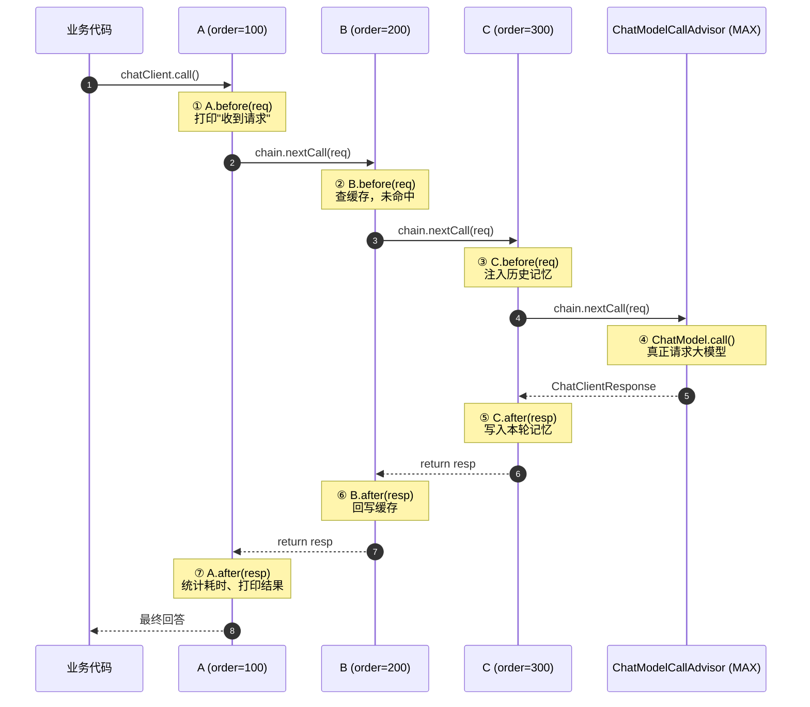
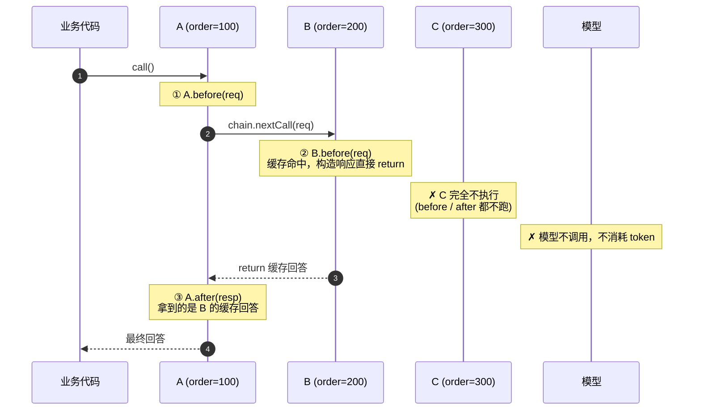
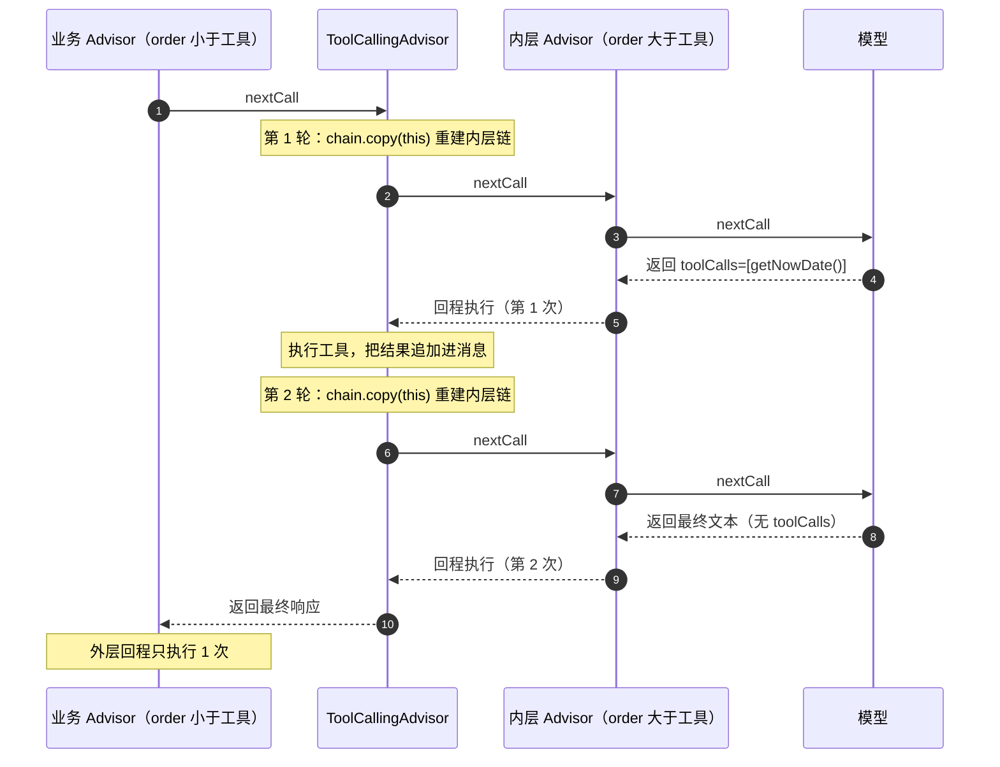
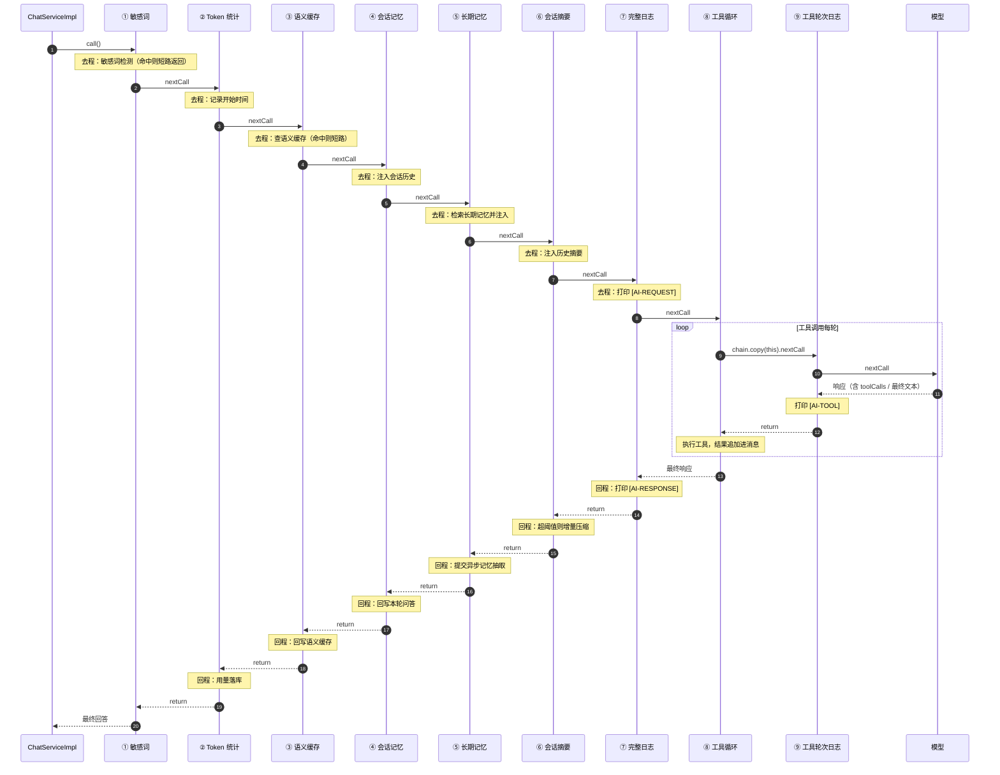

# Spring AI Advisor 执行链路详解

> 适用版本：Spring AI **2.0.1**（`spring-ai-client-chat`）
> 结合本项目 `lion-agent` 的实际链路（`AiConfig#chatClient`）讲解

---

## 目录

1. [一句话结论](#1-一句话结论)
2. [核心接口与角色](#2-核心接口与角色)
3. [谁在驱动这条链](#3-谁在驱动这条链)
4. [order 到底决定了什么](#4-order-到底决定了什么)
5. [例子：A / B / C 三个 Advisor 的完整执行过程](#5-例子abc-三个-advisor-的完整执行过程)
6. [短路：不调用 nextCall 会发生什么](#6-短路不调用-nextcall-会发生什么)
7. [流式是另一条链](#7-流式是另一条链)
8. [工具循环：最容易踩的坑](#8-工具循环最容易踩的坑)
9. [Spring AI 内置 Advisor 一览](#9-spring-ai-内置-advisor-一览)
10. [本项目实际链路](#10-本项目实际链路)
11. [排错清单](#11-排错清单)

---

## 1. 一句话结论

> Advisor 是一个**洋葱模型的责任链**：`order` 越小越靠外层。
> **请求阶段**由外向内依次执行，`chain.nextCall(...)` 是分界线，**响应阶段**由内向外依次执行。
> 分界线之前的代码 = "去程"，之后的代码 = "回程"。

```java
public ChatClientResponse adviseCall(ChatClientRequest req, CallAdvisorChain chain) {
    // ===== 去程（请求阶段）：外层 → 内层，可以改 prompt、注入上下文 =====
    ChatClientRequest newReq = req.mutate()....build();

    ChatClientResponse resp = chain.nextCall(newReq);   // ← 分界线

    // ===== 回程（响应阶段）：内层 → 外层，可以改响应、统计、落库 =====
    return resp;
}
```

**没有"回来的另一个方法"** —— 回程就是 `nextCall()` 之后的那些代码。

---

## 2. 核心接口与角色

| 接口 / 类 | 作用 |
| --- | --- |
| `Advisor` | 顶层接口，只有 `getName()` 与 `getOrder()`（继承 `Ordered`） |
| `CallAdvisor` | 同步链节点：`adviseCall(request, chain) -> ChatClientResponse` |
| `StreamAdvisor` | 流式链节点：`adviseStream(request, chain) -> Flux<ChatClientResponse>` |
| `BaseAdvisor` | **推荐继承的基类**：把两阶段拆成 `before()` / `after()`，且同时是 `CallAdvisor` + `StreamAdvisor` |
| `BaseChatMemoryAdvisor` | 记忆类 Advisor 基类（`MessageChatMemoryAdvisor` 的父类） |
| `CallAdvisorChain` / `StreamAdvisorChain` | 链上下文，只有 `nextCall()` / `nextStream()` 与 `copy(advisor)` |
| `ChatClientRequest` | 记录类：`prompt()`（消息 + options）+ `context()`（Map，Advisor 之间传参） |
| `ChatClientResponse` | 记录类：`chatResponse()`（模型响应）+ `context()` |
| `ChatModelCallAdvisor` | **链的终点**，`order = Integer.MAX_VALUE`，真正调用 `ChatModel` |

### BaseAdvisor 帮你做的事

继承 `BaseAdvisor` 时，框架等价于替你生成了这段代码：

```java
public ChatClientResponse adviseCall(req, chain) {
    ChatClientRequest updated = before(req, chain);     // 去程
    ChatClientResponse resp = chain.nextCall(updated);  // 分界线
    return after(resp, chain);                          // 回程
}

public Flux<ChatClientResponse> adviseStream(req, chain) {
    ChatClientRequest updated = before(req, chain);
    return chain.nextStream(updated)
            .map(resp -> after(resp, chain));           // 注意：每个分片都会走 after
}
```

> ⚠️ `BaseAdvisor#after` 在**流式**下是**每个分片执行一次**。要做"整段结束后只做一次"的事情（落库、抽取记忆），不能用 `BaseAdvisor#after`，必须自己写 `adviseStream` + `doOnComplete`（本项目 `LongTermMemoryAdvisor` 就是这么做的）。

---

## 3. 谁在驱动这条链

```
业务代码 chatClient.prompt()...call()
        │
        ▼
DefaultChatClient.DefaultChatClientRequestSpec
        │  收集 defaultAdvisors + 本次 advisors(...) + 自动挂载的 Advisor（如工具 Advisor）
        │  按 getOrder() 升序排列 → 外层在前
        ▼
DefaultAroundAdvisorChain  （CallAdvisorChain / StreamAdvisorChain 的实现）
        │  逐个调用 advisor.adviseCall(req, chain)
        │  每个 advisor 内部再调 chain.nextCall(...) 推动下一个
        ▼
ChatModelCallAdvisor（order = Integer.MAX_VALUE，永远在最后）
        │
        ▼
ChatModel.call()  ← 真正发起 HTTP 请求到大模型
```

**关键点：**

1. 链是**嵌套调用**出来的，不是 for 循环遍历出来的。每个 Advisor 不调 `nextCall`，后面的就一个都不会执行。
2. `chain.copy(advisor)` 会从某个 Advisor 开始**重建它之后的链** —— 这是工具循环的基础（见第 8 节）。
3. **注册顺序建议按 `order` 升序书写**：语义上框架按 `getOrder()` 组织链路，但把 add 顺序也写成升序，可以在任何实现下都得到一致结果，且可读性最好（本项目 `AiConfig` 就是这么做的）。

---

## 4. order 到底决定了什么

```
order 小 ─────────────────────────────────────► order 大
最外层                                          最内层
请求：先执行                                    请求：后执行
响应：后执行                                    响应：先执行
```

```java
@Override
public int getOrder() {
    return 100;   // 越小越外层
}
```

- 想**最先看到用户原始输入**（敏感词、权限、审计）→ order 最小；
- 想**看到最终完整结果**（Token 统计、审计落库）→ 也要 order 最小（因为回程它最后执行）；
- 想**改 prompt 喂给模型**（记忆注入、RAG 上下文）→ order 中等，越靠内越接近模型看到的真实内容；
- 想**看模型每一轮的原始输出**（工具调用日志）→ order 必须大于工具 Advisor（进入循环内部）。

---

## 5. 例子：A / B / C 三个 Advisor 的完整执行过程

假设三个 Advisor：

| Advisor | order | 去程（before） | 回程（after） |
| --- | --- | --- | --- |
| A | 100 | 打印"收到请求" | 打印"最终返回"，统计耗时 |
| B | 200 | 命中缓存则**直接返回**（短路） | 把回答写入缓存 |
| C | 300 | 注入历史记忆 | 把本轮问答写入记忆 |

### 5.1 时序图（正常链路，未命中缓存）



调用栈在 ④ 处最深，看起来是这样一层套一层的：

```
A.adviseCall
 └─ A.before
 └─ chain.nextCall
     └─ B.adviseCall
         └─ B.before
         └─ chain.nextCall
             └─ C.adviseCall
                 └─ C.before
                 └─ chain.nextCall
                     └─ ChatModelCallAdvisor → 模型
                 └─ C.after
         └─ B.after
 └─ A.after
```

### 5.2 打印顺序（一眼记住）

```
A 去程 → B 去程 → C 去程 → 模型 → C 回程 → B 回程 → A 回程
```

### 5.3 换成裸 `CallAdvisor` 写法（不用 BaseAdvisor）

```java
public class B implements CallAdvisor, StreamAdvisor {

    @Override
    public ChatClientResponse adviseCall(ChatClientRequest req, CallAdvisorChain chain) {
        // ---------- 去程 ----------
        String cached = cache.get(req.prompt().getUserMessage().getText());
        if (cached != null) {
            return ChatClientResponse.builder()          // ← 短路：不调 nextCall
                    .chatResponse(ChatResponse.builder()
                            .generations(List.of(new Generation(cached))).build())
                    .context(req.context())
                    .build();
        }
        // ---------- 分界线 ----------
        ChatClientResponse resp = chain.nextCall(req);
        // ---------- 回程 ----------
        cache.put(userText, resp.chatResponse().getResult().getOutput().getText());
        return resp;
    }
}
```

### 5.4 洋葱图（ASCII 版）

```
┌──────────────────────────────────────────────────────┐
│  A (order=100)                                       │
│  ┌────────────────────────────────────────────────┐  │
│  │  B (order=200)                                 │  │
│  │  ┌──────────────────────────────────────────┐  │  │
│  │  │  C (order=300)                           │  │  │
│  │  │  ┌────────────────────────────────────┐  │  │  │
│  │  │  │  ChatModelCallAdvisor (MAX)        │  │  │  │
│  │  │  │          大模型                     │  │  │  │
│  │  │  └────────────────────────────────────┘  │  │  │
│  │  └──────────────────────────────────────────┘  │  │
│  └────────────────────────────────────────────────┘  │
└──────────────────────────────────────────────────────┘
  去程：由外向内 ──────────────►
  回程：◄────────────── 由内向外
```

---

## 6. 短路：不调用 nextCall 会发生什么

接着上面的例子，假设 **B 命中了缓存**，直接 `return` 不调 `chain.nextCall()`：



**规则：**

| 问题 | 结论 |
| --- | --- |
| B 短路后，C 会执行吗？ | ❌ 不会，C 在 B 内层，`adviseCall` 根本不会进入 |
| B 短路后，模型会调用吗？ | ❌ 不会，不消耗 token |
| B 短路后，B 自己的回程代码会执行吗？ | ❌ 不会，没走到那行（`return` 之前就结束了） |
| B 短路后，A 的回程代码会执行吗？ | ✅ 会，A 拿到的 `resp` 就是 B 短路返回的那个响应 |
| A 能拿到最终答案吗？ | ✅ 能，就是 B 构造的响应（且可能被 A 的回程再加工） |

**两个必须注意的点：**

1. **短路响应要构造完整**，否则外层 A 容易 NPE：
   `ChatResponse` + `Generation` 都要有，并且把 `context` 原样带上（下游 Advisor 可能读 `user_id` / `conversation_id`）。
2. **短路时外层仍会统计**：本项目的敏感词（①）在最外层短路，Token 统计（②）也在最外层，它的回程**照常执行**。不想记 0 token，就在短路上打个上下文标记让统计 Advisor 跳过。

---

## 7. 流式是另一条链

| 调用方式 | 收集哪些 Advisor |
| --- | --- |
| `.call()` | 只收集 **`CallAdvisor`** |
| `.stream()` | 只收集 **`StreamAdvisor`** |

> ⚠️ **只实现 `CallAdvisor` 的 Advisor，在 `.stream()` 下会被完全跳过**，一行日志都不会打。
> 想两边都生效：同时实现两个接口，或直接继承 `BaseAdvisor`。

流式下"整段结束后只做一次"的正确写法：

```java
@Override
public Flux<ChatClientResponse> adviseStream(ChatClientRequest req, StreamAdvisorChain chain) {
    StringBuilder acc = new StringBuilder();      // 累加完整正文
    return chain.nextStream(req)
            .doOnNext(r -> acc.append(textOf(r)))                 // 每个分片累加
            .doOnComplete(() -> doSomethingOnce(acc.toString()))  // 结束时只做一次
            .doOnError(e -> log.warn("出错，跳过 {}", e.getMessage()));
}
```

---

## 8. 工具循环：最容易踩的坑

### 8.1 原理

`ToolCallingAdvisor`（本项目用的是 `ToolSearchToolCallingAdvisor`）内部是一个 **while 循环**：

```java
// 简化后的逻辑
while (模型返回里还有 toolCalls && 未超过最大轮次) {
    response = chain.copy(this).nextCall(带工具结果的 request);   // ← 关键：copy
}
return response;   // 只把最后一轮的纯文本响应交给外层
```

`chain.copy(this)` 的作用是：**重建"排在我之后"的那段链，重新跑一遍**。

### 8.2 后果：内层 Advisor 会被执行 N 次



**所以：**

| 放置位置 | 去程/回程执行次数 | 后果 |
| --- | --- | --- |
| 工具**外层**（order 更小） | 各 1 次 | ✅ 正确 |
| 工具**内层**（order 更大） | 每轮工具调用各 1 次 | ❌ 记忆重复注入、摘要重复落库、Token 统计被拆成多条 |

> 这也是本项目把所有业务 Advisor 压到 `Integer.MIN_VALUE + n`、把工具 Advisor 压到 `Integer.MAX_VALUE - 100` 的原因。

### 8.3 副作用：外层永远看不到 tool call

工具循环会把「模型返回 toolCalls → 执行工具 → 回灌结果再调一次」整个收敛掉，**只把最后一轮的纯文本响应交给外层**。

所以任何放在工具循环**外面**的日志 Advisor，打印出来的「工具调用」**永远是"无"** —— 这不是链路没跑工具，是框架行为。

要看每轮的工具调用，必须再放一个实例在工具循环**内部**（order 大于工具 Advisor），本项目即 `ChatLoggerAdvisor(TOOL_LOGGER_ORDER = MAX - 50, ..., toolRoundOnly = true)`，专门打印 `[AI-TOOL]`。

---

## 9. Spring AI 内置 Advisor 一览

| Advisor | 默认 order | 作用 | 备注 |
| --- | --- | --- | --- |
| `ChatModelCallAdvisor` | `Integer.MAX_VALUE` | **链终点**，调用 `ChatModel` | 框架自动加入，无需手动注册 |
| `ToolCallingAdvisor` | 0（可用 `Builder.advisorOrder(int)` 改） | 工具调用循环本体 | 内部 `chain.copy(this)`，见第 8 节 |
| `ToolSearchToolCallingAdvisor` | 同上 | 先按语义检索工具，再执行 | 本项目启用，配合 `ToolIndex` |
| `MessageChatMemoryAdvisor` | 0（用 `Builder.order(int)` 改） | 把会话历史作为**消息**注入 | 最常用 |
| `PromptChatMemoryAdvisor` | 0 | 把历史拼进 system prompt | 同上，形式不同 |
| `VectorStoreChatMemoryAdvisor` | 0 | 用向量库检索历史 | 长期记忆场景 |
| `QuestionAnswerAdvisor` | 0 | RAG：检索 `VectorStore` 并填充上下文 | 官方 RAG 入口 |
| `SimpleLoggerAdvisor` | 0 | 打印请求/响应（DEBUG） | 本项目已用自定义 `ChatLoggerAdvisor` 替代 |
| `SafeGuardAdvisor` | 0 | 敏感词拦截 | 本项目用 `SensitiveWordAdvisor` 替代（支持动态词库） |
| `ReReadingAdvisor` | 0 | 把问题重写一遍再问（Re2 技巧） | 提升推理类问题效果 |

> 除 `ChatModelCallAdvisor` 固定为 `Integer.MAX_VALUE` 外，**内置 Advisor 默认基本都是 0**，同 order 时先后顺序由实现决定 —— 因此**凡是链路敏感的 Advisor，都要显式指定 order**，不要依赖默认值。

### 内置 vs 自定义：本项目用了哪些

| 类型 | Advisor |
| --- | --- |
| 官方内置 | `MessageChatMemoryAdvisor`、`ToolSearchToolCallingAdvisor`、`ChatModelCallAdvisor`（自动） |
| 项目自定义 | `SensitiveWordAdvisor`、`TokenUsageAdvisor`、`QaCacheAdvisor`、`LongTermMemoryAdvisor`、`ConversationSummaryAdvisor`、`ChatLoggerAdvisor` |

---

## 10. 本项目实际链路

`AiConfig#chatClient` 注册的 Advisor（按 order 升序，代码顺序 = 执行顺序）：

| 序号 | Advisor | order | 作用 |
| --- | --- | --- | --- |
| ① | `SensitiveWordAdvisor` | `MIN + 50` | 命中即短路：不读记忆、不调模型、不耗 token |
| ② | `TokenUsageAdvisor` | `MIN + 100` | 拿含全部工具轮次的累计用量，一次对话一条 |
| ③ | `QaCacheAdvisor` | `MIN + 150` | 语义缓存命中即短路，跳过记忆与工具 |
| ④ | `MessageChatMemoryAdvisor` | `MIN + 200` | 会话历史注入 / 最终回答回写（JDBC 窗口记忆） |
| ⑤ | `LongTermMemoryAdvisor` | `MIN + 220` | 注入跨会话事实与偏好；**响应阶段**提交异步抽取 |
| ⑥ | `ConversationSummaryAdvisor` | `MIN + 240` | 注入历史摘要，超阈值增量压缩 |
| ⑦ | `ChatLoggerAdvisor` | `0` | 完整日志：注入记忆后的 prompt + 最终响应 |
| ⑧ | `ToolSearchToolCallingAdvisor` | `MAX - 100` | 工具循环本体（**自动挂载**，不手动 add） |
| ⑨ | `ChatLoggerAdvisor(工具轮次)` | `MAX - 50` | 循环内，打印每轮的工具调用与工具返回 |
| — | `ChatModelCallAdvisor` | `MAX` | 模型（框架自动） |

### 链路时序图



### 设计要点回顾

- **① ② 都在最外层**：② 放在外层才能在回程拿到"经过完整链路（含所有工具轮次）"的最终响应，做到一次对话一条用量；放内层会被工具循环拆成多条。
- **③ 在记忆/工具之前**：缓存命中直接短路，连记忆读取、工具执行都省掉。
- **④ ⑤ ⑥ 都在工具外层**：保证记忆注入、摘要压缩、记忆抽取每次对话只做一次。
- **⑦ 在 ⑧ 之前**：打印的是"记忆注入之后、工具执行之前"的真实 prompt —— 排查问题最有用的视角。
- **⑨ 在 ⑧ 之后**：进入工具循环内部，才能看到模型每轮发起的工具调用。

### 短路时的行为（以敏感词为例）

```
① 敏感词命中 → return 拒答
   ✗ ② 的去程不执行，但回程会执行（拿到拒答响应，用量按 0 记录）
   ✗ ③④⑤⑥⑦ 全部不执行（不读记忆、不注入、不打日志）
   ✗ ⑧⑨ 不执行（不调工具、不调模型）
```

---

## 11. 排错清单

| 现象 | 原因 | 解决 |
| --- | --- | --- |
| `.stream()` 下 Advisor 完全不生效 | 只实现了 `CallAdvisor` | 同时实现 `StreamAdvisor` 或继承 `BaseAdvisor` |
| 记忆被重复注入 / 摘要被重复落库 | Advisor 的 order 大于工具 Advisor，被圈进循环 | 把 order 调小，放到工具外层 |
| Token 用量一次对话出现多条 | 统计 Advisor 在工具循环内 | order 调到工具之外（本项目 ②） |
| 日志里「工具调用」永远是"无" | 日志 Advisor 在工具循环外（正常现象） | 在循环内再挂一个实例（本项目 ⑨） |
| 一次对话打了多份完整日志 | 完整日志 Advisor 被工具循环包含 | 把它的 order 调到工具 Advisor 之前 |
| 敏感词拒答也产生了 Token 记录 / 记忆 | 统计/抽取 Advisor 在最外层，回程照常执行 | 在短路响应里打上下文标记，让它们在回程跳过 |
| 流式下某个动作执行了 N 次（N = 分片数） | 用了 `BaseAdvisor#after` | 改写 `adviseStream` + `doOnComplete` |
| 上游短路后下游 NPE | 短路响应没构造 `ChatResponse`/`Generation`，或丢了 `context` | 补全响应体并原样传递 `context` |
| 内部调用（如摘要压缩）误触发记忆抽取/统计 | context 里没有 `user_id` | 加前置判断：`userId == null` 直接跳过 |

### 传参约定

Advisor 之间靠 `ChatClientRequest.context()`（一个 `Map<String, Object>`）传递业务参数，业务层注入方式：

```java
chatClient.prompt()
        .system(systemPrompt)
        .user(message)
        .advisors(a -> a
                .param(ChatMemory.CONVERSATION_ID, conversationId)
                .param(AdvisorConstants.USER_ID_KEY, userId)
                .param(AdvisorConstants.CHAT_TYPE_KEY, chatType)
                .param(AdvisorConstants.RAW_USER_MESSAGE_KEY, rawUserMessage))
        .call();
```

> ⚠️ 多个 `param` 必须写在**同一个 `advisors(...)` 调用**里，分多次调用会互相覆盖。
> 本项目把这些 Key 统一收在 `AdvisorConstants`，避免各处硬编码字符串。
